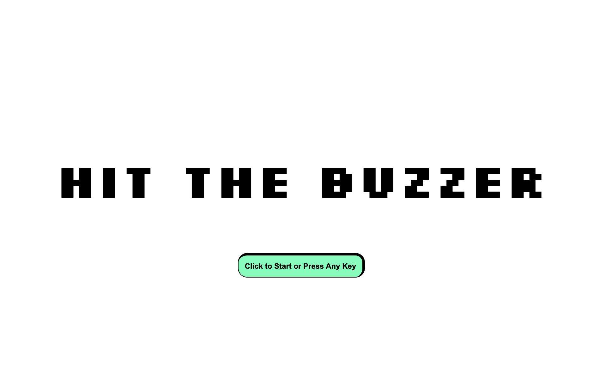
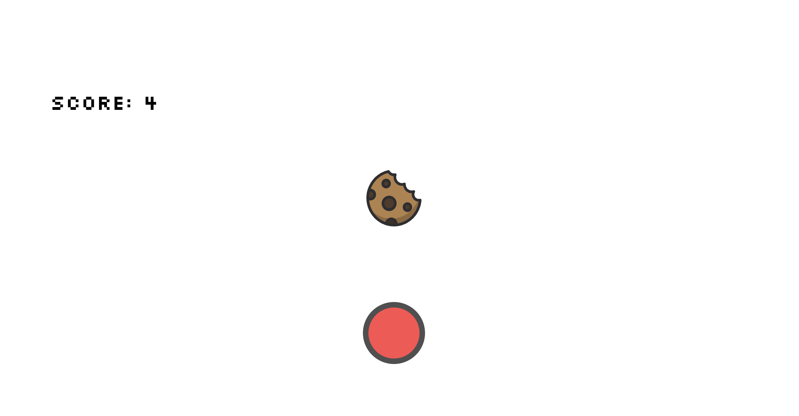

# Hit The Buzzer Win A Cookie 

### Description
The primary focus of this project was to strengthen skills in DOM manipulation, HTML, CSS, and JavaScript. This is a simple game where the user will press a button to win a cookie. The more you press the button the more cookies you win. After eating a certain amount of cookies the user will get full and the game terminates.

### How to Play
Press the button to eat as many cookies as you can. You have 2 minutes to eat as many cookies as your cookie goal or more. If time runs out and your cookie goal is not met then you lose. If you meet your goal then you win.

### Technologies Used

HTML

CSS

JavaScript

### Planned Additional Features
- [x] If user does not press the button enough times within a certain amount of time then user loses

- If user does not press the button within a certain amount of time then the score will decrease by a certain amount

- [x] Add effect to button press. Giving the illusion of an actual button press

- Add a moving effect to the button. Button should move from left to right and gradually increase speed after each button press to make it harder to hit the buzzer.